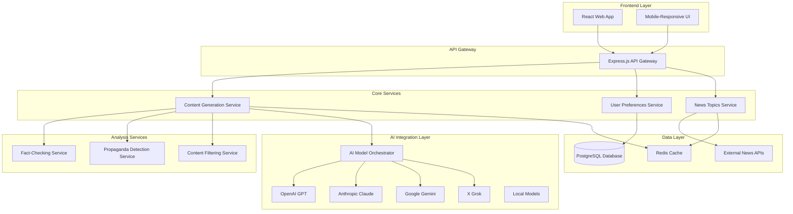

# Design Document

## Overview

The AI News Site is a full-stack web application that generates personalized news content using multiple AI language models. The system allows users to customize their news reading experience through perspective, tone, language, and content filtering preferences while providing advanced features like fact-checking and propaganda detection.

The architecture follows a microservices pattern with a React frontend, Node.js/Express backend, and specialized services for AI content generation, fact-checking, and content analysis.

## Architecture

### Development Approach

The system follows an **API-first development approach** to enable independent frontend and backend development:

- **Contract-First Design**: OpenAPI specification defines all endpoints before implementation
- **Mock API Server**: Frontend development can proceed with mock responses
- **Versioned APIs**: API versioning prevents breaking changes during development
- **Shared Type Definitions**: TypeScript interfaces shared between frontend and backend
- **Independent Deployment**: Frontend and backend can be deployed separately
- **Environment Parity**: Development, staging, and production environments mirror each other

### Best Practices Integration

- **Clean Architecture**: Separation of business logic from infrastructure concerns
- **SOLID Principles**: Dependency injection and interface segregation
- **Domain-Driven Design**: Clear domain boundaries and ubiquitous language
- **Test-Driven Development**: Tests written before implementation
- **Continuous Integration**: Automated testing and deployment pipelines
- **Code Quality**: ESLint, Prettier, and SonarQube integration
- **Security by Design**: OWASP guidelines and security scanning

### Development Workflow

**Phase 1: API Contract Definition**
1. Define OpenAPI 3.0 specification for all endpoints
2. Generate TypeScript types from OpenAPI spec
3. Set up mock API server using tools like MSW or json-server
4. Validate API contracts with both teams

**Phase 2: Parallel Development**
- **Frontend Team**: Develops against mock API, focuses on UI/UX
- **Backend Team**: Implements actual API endpoints, focuses on business logic
- **Shared**: Both teams use the same TypeScript interfaces

**Phase 3: Integration**
1. Replace mock API with real backend endpoints
2. Run integration tests to validate contract compliance
3. Address any discrepancies between mock and real implementations

### Development Environment Setup

**Frontend Development:**
```bash
# Independent frontend development
npm run dev:frontend    # Runs with mock API
npm run dev:integrated  # Runs with real backend
npm run test:frontend   # Frontend-only tests
```

**Backend Development:**
```bash
# Independent backend development
npm run dev:backend     # Runs backend services
npm run test:backend    # Backend-only tests
npm run test:api        # API contract validation
```

**Full Stack Development:**
```bash
# Integrated development
npm run dev:fullstack   # Runs both frontend and backend
npm run test:e2e        # End-to-end tests
```

### High-Level Architecture



### Technology Stack

**Frontend:**
- React 18 with TypeScript
- Tailwind CSS for responsive design
- React Query for state management and caching
- React Router for navigation

**Backend:**
- Node.js with Express.js
- TypeScript for type safety
- JWT for authentication
- Rate limiting and security middleware

**Database & Caching:**
- PostgreSQL for user preferences and metadata
- Redis for content caching and session management

**AI Integration:**
- OpenAI API (GPT-4, GPT-3.5)
- Anthropic Claude API
- Google Gemini API
- X Grok API
- Ollama for local model support

**External Services:**
- News API for current topics
- Fact-checking APIs (FactCheck.org, Snopes)
- Translation services for multi-language support

## Components and Interfaces

### Frontend Components

#### Core Layout Components
- `AppLayout`: Main application wrapper with navigation and settings
- `Header`: Navigation bar with user preferences quick access
- `Sidebar`: Settings panel for all customization options
- `ArticleGrid`: Responsive grid layout for article display

#### Content Components
- `ArticleCard`: Individual article preview with metadata
- `ArticleView`: Full article display with fact-checking overlays
- `FactCheckIndicator`: Interactive fact-checking annotations
- `PropagandaWarning`: Propaganda detection alerts

#### Settings Components
- `PerspectiveSelector`: Political perspective selection dropdown
- `ToneSelector`: Writing tone selection interface
- `LanguageSelector`: Language preference selector
- `ModelSelector`: AI model selection with capability descriptions
- `ContentFilters`: Topic and person filtering interface
- `AnalysisToggles`: Fact-checking and propaganda detection toggles

### Backend API Endpoints

#### Content Generation API
```typescript
POST /api/content/generate
{
  topic: string;
  perspective: 'conservative' | 'liberal' | 'democratic' | 'progressive' | 'neutral';
  tone: 'formal' | 'casual' | 'analytical' | 'conversational' | 'professional';
  language: string;
  model: string;
  enableFactCheck: boolean;
  enablePropagandaDetection: boolean;
}

Response: {
  article: {
    title: string;
    content: string;
    metadata: ArticleMetadata;
    factChecks?: FactCheck[];
    propagandaAnalysis?: PropagandaAnalysis;
  }
}
```

#### User Preferences API
```typescript
GET /api/user/preferences
PUT /api/user/preferences
{
  perspective: string;
  tone: string;
  language: string;
  selectedModel: string;
  contentFilters: {
    includedTopics: string[];
    excludedTopics: string[];
    includedPeople: string[];
    excludedPeople: string[];
  };
  analysisSettings: {
    factCheckEnabled: boolean;
    propagandaDetectionEnabled: boolean;
    propagandaSensitivity: number;
  };
}
```

#### News Topics API
```typescript
GET /api/news/topics
Response: {
  topics: Array<{
    id: string;
    title: string;
    category: string;
    trending: boolean;
    lastUpdated: string;
  }>
}
```

### AI Model Orchestrator Interface

```typescript
interface AIModelOrchestrator {
  generateContent(request: ContentGenerationRequest): Promise<GeneratedContent>;
  getAvailableModels(): Promise<ModelInfo[]>;
  validateModelAvailability(modelId: string): Promise<boolean>;
}

interface ContentGenerationRequest {
  topic: string;
  perspective: PoliticalPerspective;
  tone: WritingTone;
  language: string;
  modelId: string;
  maxTokens: number;
}

interface GeneratedContent {
  title: string;
  content: string;
  metadata: {
    modelUsed: string;
    generationTime: number;
    tokenCount: number;
    confidence: number;
  };
}
```

## Data Models

### User Preferences Model
```typescript
interface UserPreferences {
  id: string;
  userId: string;
  perspective: PoliticalPerspective;
  tone: WritingTone;
  language: string;
  selectedModel: string;
  contentFilters: ContentFilters;
  analysisSettings: AnalysisSettings;
  createdAt: Date;
  updatedAt: Date;
}

interface ContentFilters {
  includedTopics: string[];
  excludedTopics: string[];
  includedPeople: string[];
  excludedPeople: string[];
}

interface AnalysisSettings {
  factCheckEnabled: boolean;
  propagandaDetectionEnabled: boolean;
  propagandaSensitivity: number; // 1-10 scale
}
```

### Article Model
```typescript
interface Article {
  id: string;
  title: string;
  content: string;
  topic: string;
  perspective: PoliticalPerspective;
  tone: WritingTone;
  language: string;
  modelUsed: string;
  factChecks?: FactCheck[];
  propagandaAnalysis?: PropagandaAnalysis;
  metadata: ArticleMetadata;
  createdAt: Date;
}

interface FactCheck {
  claim: string;
  startIndex: number;
  endIndex: number;
  verificationStatus: 'verified' | 'disputed' | 'false' | 'unverified';
  confidence: number;
  sources: Source[];
}

interface PropagandaAnalysis {
  overallScore: number;
  techniques: PropagandaTechnique[];
  warnings: string[];
}

interface ArticleMetadata {
  generationTime: number;
  tokenCount: number;
  cacheHit: boolean;
  aiDisclaimer: string;
}
```

### News Topic Model
```typescript
interface NewsTopic {
  id: string;
  title: string;
  category: string;
  description: string;
  trending: boolean;
  sourceUrls: string[];
  lastUpdated: Date;
  popularity: number;
}
```

## Error Handling

### Frontend Error Handling
- Global error boundary for React component errors
- Toast notifications for user-facing errors
- Retry mechanisms for failed API calls
- Graceful degradation when services are unavailable

### Backend Error Handling
- Centralized error handling middleware
- Structured error responses with error codes
- Logging and monitoring integration
- Circuit breaker pattern for external API calls

### AI Service Error Handling
- Model fallback system (if primary model fails, try secondary)
- Timeout handling for long-running generation requests
- Rate limit handling with exponential backoff
- Content validation and safety checks

## Testing Strategy

### Frontend Testing
- Unit tests for React components using Jest and React Testing Library
- Integration tests for user workflows
- Visual regression testing for responsive design
- Accessibility testing with axe-core

### Backend Testing
- Unit tests for service layer logic
- Integration tests for API endpoints
- Load testing for content generation performance
- End-to-end tests for complete user journeys

### AI Integration Testing
- Mock AI responses for consistent testing
- Performance testing for different model combinations
- Content quality validation tests
- Fact-checking accuracy validation

### Security Testing
- Input validation and sanitization tests
- Authentication and authorization tests
- Rate limiting effectiveness tests
- Content safety and moderation tests

## Performance Considerations

### Caching Strategy
- Redis caching for generated articles with TTL based on topic volatility
- Browser caching for static assets and user preferences
- CDN integration for global content delivery
- Database query optimization with proper indexing

### Content Generation Optimization
- Parallel processing for multiple article requests
- Streaming responses for long-form content
- Background pre-generation for trending topics
- Model selection optimization based on performance metrics

### Scalability Design
- Horizontal scaling for content generation services
- Load balancing across multiple AI model instances
- Database read replicas for improved performance
- Microservices architecture for independent scaling